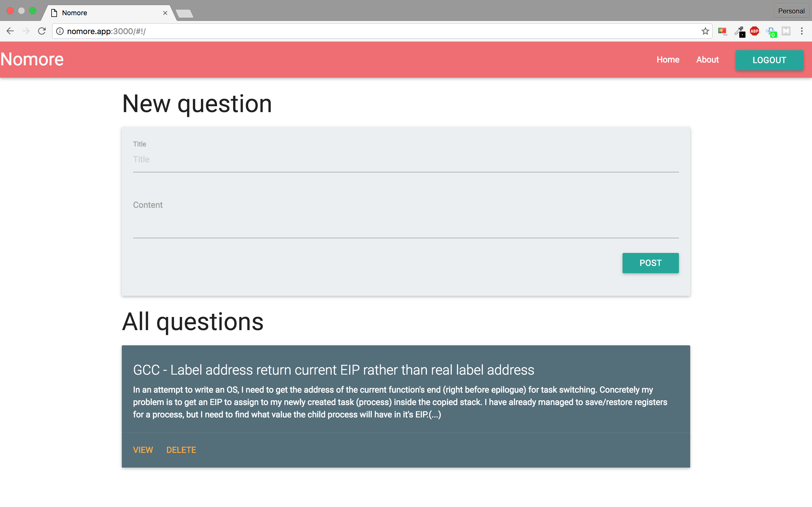

# Example

This is an example project to show the integration of a Single-Page-App (SPA) with an API developed using Stellar.



## Pre-requirements

- Stellar must be installed;
- TCP port 8080 and 3000 must be open and no program should be listening this two ports.

## Running the App

To start the server you need to execute the follow commands:

```shell
$ cd <projectFolder>/server
$ stellar run
```

In another terminal window you need to execute the follow commands lines to start the client application:

```shell
$ cd <projectFolder>/client
$ npm install
$ npm run dev
```

Now the API are running on the TCP port 8080 and the client on port 3000.
